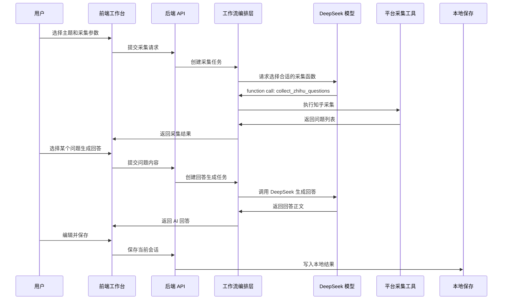

# 内容采集与回答工作台

这个项目现在采用前后端分离架构：

- 后端：`Python + FastAPI + uv`
- 前端：`bun + Vite + React + Tailwind CSS`

当前目标是提供一个本地可视化工作台，用来：

- 按主题采集站点问题或内容线索
- 查看问题标题、链接、回答数、更新时间
- 对单条或批量问题生成 AI 回答
- 在线编辑回答并保存到本地

## 当前结构

### 后端

- [app/server.py](/Users/lius/Desktop/self/content-answer-workspace/app/server.py)：FastAPI 入口
- [app/api/routes/config.py](/Users/lius/Desktop/self/content-answer-workspace/app/api/routes/config.py)：配置接口
- [app/api/routes/workflow.py](/Users/lius/Desktop/self/content-answer-workspace/app/api/routes/workflow.py)：采集和生成接口
- [app/api/routes/session.py](/Users/lius/Desktop/self/content-answer-workspace/app/api/routes/session.py)：会话保存与恢复接口
- [app/services/zhihu_service.py](/Users/lius/Desktop/self/content-answer-workspace/app/services/zhihu_service.py)：站点采集逻辑（当前实现为知乎）
- [app/services/answer_service.py](/Users/lius/Desktop/self/content-answer-workspace/app/services/answer_service.py)：模型回答生成逻辑
- [app/services/session_service.py](/Users/lius/Desktop/self/content-answer-workspace/app/services/session_service.py)：本地会话保存逻辑
- [app/core/config.py](/Users/lius/Desktop/self/content-answer-workspace/app/core/config.py)：环境变量与默认配置
- [app/core/prompts.py](/Users/lius/Desktop/self/content-answer-workspace/app/core/prompts.py)：默认提示词

### 前端

- [frontend/package.json](/Users/lius/Desktop/self/content-answer-workspace/frontend/package.json)
- [frontend/vite.config.ts](/Users/lius/Desktop/self/content-answer-workspace/frontend/vite.config.ts)
- [frontend/src/app/App.tsx](/Users/lius/Desktop/self/content-answer-workspace/frontend/src/app/App.tsx)
- [frontend/src/features/workspace/workspace-shell.tsx](/Users/lius/Desktop/self/content-answer-workspace/frontend/src/features/workspace/workspace-shell.tsx)
- [frontend/src/features/workspace/use-workspace.ts](/Users/lius/Desktop/self/content-answer-workspace/frontend/src/features/workspace/use-workspace.ts)
- [frontend/src/store/workspace-store.ts](/Users/lius/Desktop/self/content-answer-workspace/frontend/src/store/workspace-store.ts)

## 环境变量

先复制环境变量模板：

```bash
cp .env.example .env
```

至少需要补齐：

- `OPENAI_API_KEY`

当前默认兼容智谱 AI：

- `OPENAI_BASE_URL=https://open.bigmodel.cn/api/paas/v4/`
- `OPENAI_MODEL=GLM-4.7`

当前站点采集相关：

- `ZHIHU_COOKIE_FILE`
- `ZHIHU_API_URL`
- `ZHIHU_REFERER`
- `ZHIHU_X_REQUESTED_WITH`
- `ZHIHU_X_ZSE_93`
- `ZHIHU_X_ZSE_96`

## 后端启动

安装 Python 依赖：

```bash
uv sync
```

启动后端：

```bash
uv run python -m app.server
```

默认后端地址：

- `http://127.0.0.1:3000`

## 前端启动

前端命令请你本地执行。

进入前端目录后，安装依赖：

```bash
cd /Users/lius/Desktop/self/content-answer-workspace/frontend
bun install
```

开发模式启动：

```bash
bun run dev
```

默认前端地址：

- `http://127.0.0.1:5173`

Vite 已经配置好代理：

- `/api/*` -> `http://127.0.0.1:3000`

## 构建前端

如果你要让 FastAPI 直接托管前端打包产物，请在 `frontend/` 目录执行：

```bash
bun run build
```

构建后会生成：

- `frontend/dist`

此时后端访问 `/` 会直接返回打包后的前端页面。

## 当前 API

新接口：

- `GET /api/health`
- `GET /api/config`
- `GET /api/session/latest`
- `POST /api/session/save`
- `GET /api/session/cookie-status`
- `POST /api/workflow/collect`
- `POST /api/workflow/generate`
- `POST /api/workflow/generate-one`

兼容旧接口：

- `POST /api/run`
- `POST /api/regenerate`
- `POST /api/generate-all`
- `POST /api/save`

## 一次性完整流程架构图



## 当前状态

已经完成：

- Python 后端服务拆分
- 新前端工程初始化
- 三栏工作台基础结构
- 主题配置、问题采集、批量生成、单条生成、保存会话的前端接线

仍需你本地验证：

- `bun install`
- `bun run dev`
- 页面联调与样式微调

## 风险

- 当前知乎搜索接口会混入非问题卡片，后端已做跳过处理，但仍需要持续维护
- 当前知乎风控和 cookie 失效会直接影响采集结果
- 模型返回风格仍建议人工复核后再发布


## 其他项目

- https://github.com/NanmiCoder/MediaCrawler
- https://github.com/Thysrael/Horizon/blob/main/README_zh.md