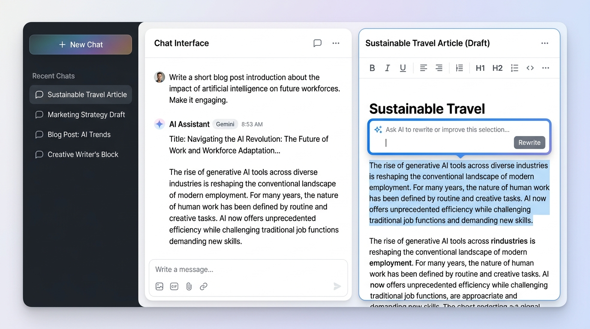

# Chat-First Agent 重构方案与最终目标

将该项目打造为一个**“Chat-first（对话即界面）”的内容创作引擎**。告别过去割裂的“多页面、多表单、多步骤”传统后台模式，通过单一的对话框窗口实现全流程（URL 解析、主题采集、内容生成、润色调整），实现“隐式指令 -> 结果流 -> 直接编辑”的流畅闭环。

---

## 1. 前端 UI 与路由的极简瘦身

### 彻底移除历史包袱
删除旧版的 `workbench` 目录，以及现有的“导入”、“采集”、“热榜”等独立功能页面。让界面回归最纯粹的内容创造。

### 极简路由与全局弹窗
整个应用最终**只保留唯一的一个核心路由：`/chat`**。
左侧侧边栏只提供“新建对话”和历史记录，而 **“设置”** 入口将被改造为全局的**弹窗（Modal / Dialog）**。这样用户无需离开当前对话流，随时可以呼出弹窗修改 API Key 或系统参数。

## 2. “分屏工作台”设计 (Split-Screen UI)

### 对话区（主视野：多轮对话流）
这里是用户发号施令的中枢，**本质上是一个支持无限多轮对话的连续信息流（类似 ChatGPT）**。
- 您可以随时进行日常的多轮追问、上下文连贯的聊天。
- 无论是纯文本的对话，还是包含结构化数据的“采集列表”、“URL 解析卡片”，都只是这条时间线上的一个消息气泡（Message Bubble）。它们**绝不会打断或替换原本的聊天流**。
- 即使在右侧进行编辑时，您依然可以在左侧继续发送消息，让 AI 帮您查资料或润色句子。

### 预生成与编辑区（右侧滑出面板）
目前**暂不考虑批量生成**，采用“精准单选 -> 右侧生成”的工作流。
当用户在对话区的列表中选中某篇具体的帖子或解析卡片时，界面右侧会平滑地滑出一个专属的面板：
- **顶部参考区**：面板顶部会清晰展示当前选中的内容上下文（如原帖子的标题、摘要、数据或 URL 链接），确保生成时有明确的对照参考。
- **生成触发区**：在参考区下方提供显眼的“开始自动生成”按钮。点击后，AI 才会在下方编辑器中开始撰写回答。
- **富文本编辑区**：下方为一个 Markdown 编辑器，生成完毕后，用户可在此沉浸式地查阅、修改并润色长文，并带有本地保存、复制等操作。
  - **划词局部润色 (Inline AI Refinement)**：支持用户在编辑器中用鼠标划选一段特定的文本（如一句话或一个段落）。选中后，上方会自动弹出一个悬浮的“AI 指令输入框”。用户输入修改意图（如“把这段话改写得更幽默一点”、“扩写详细些”），AI 将仅针对选中的这部分文本进行重新生成和替换，而不影响全文结构。

## 3. 增强 Chat 功能集成：解析与采集双管齐下

### 场景一：URL 智能解析（单篇处理）
当用户在聊天框直接粘贴某个内容平台的网址时，系统将触发**URL 解析功能**。隐式调用 `web_fetch` 等解析工具，自动抓取全文并返回单张结构化的解析卡片。

### 场景二：主题采集与列表渲染（多篇检索）
当用户下达自然语言指令（如“帮我采集关于AI的热门帖子”）时，系统将触发**采集功能**。对于这类场景，Agent 返回的将不是单一气泡，而是一个**帖子列表组件 (List View)**。用户可以直观地上下滚动查看搜集到的多篇帖子结果。
在此列表中点击选中某篇帖子，即可触发上文提到的“右侧滑出面板”，进入生成准备阶段。

## 4. 后端 Agent 图路由优化

- 完善并升级 LangGraph 系统中的意图识别模块（Intent Router）。
- 建立精准的状态联动机制。确保当接收到前端 UI 传来的特定交互信号（如点击卡片直接生成的快捷指令）时，Agent 能够跳过常规的聊天模型响应流程，直接挂载目标内容相关的上下文，并无缝切入原有的 `answer_service.py` 生成处理逻辑。

## 5. 多会话管理与面板状态联动

### 左侧全局导航与会话切换
采用了类似主流 AI 助理的“极简侧边栏”布局，侧边栏作为全局持久存在的区域：
- 提供 `[+ 新建对话]` 的快捷入口。
- 按时间倒序展示历史会话列表，点击可无缝切换主视野的对话上下文。

### 右侧编辑面板的状态联动
右侧的“编辑区面板”状态**强绑定于当前的 Chat 会话**，作为当前上下文的“附属视图”：
- **场景 A（无活动编辑任务）**：若当前对话只是纯聊天、未触发生成长文，或切换到一个全新的对话，右侧编辑面板将完全隐藏，中间对话区占据屏幕主体，提供沉浸式聊天体验。
- **场景 B（有正在编辑的内容）**：右侧面板会展示对应的长文编辑器。
- **状态记忆**：每个对话都会在状态管理器中“记住”其最后处于编辑状态的文章。当在多个历史会话间切换时，右侧面板会随之切换、展开或销毁，自动恢复对应会话的工作进度。

## 6. UI 设计参考

以下是严格根据本方案生成的概念图，展示了极简侧边栏、多轮对话流、以及带有“划词局部润色”功能的右侧编辑面板。

