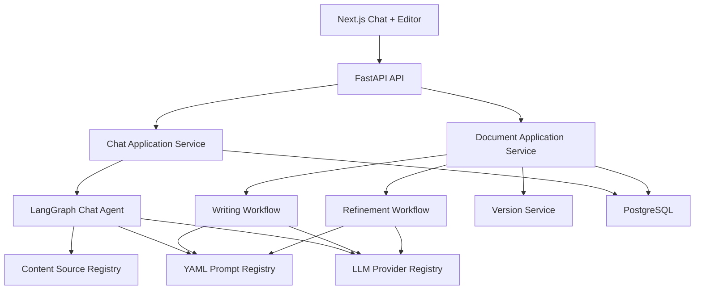
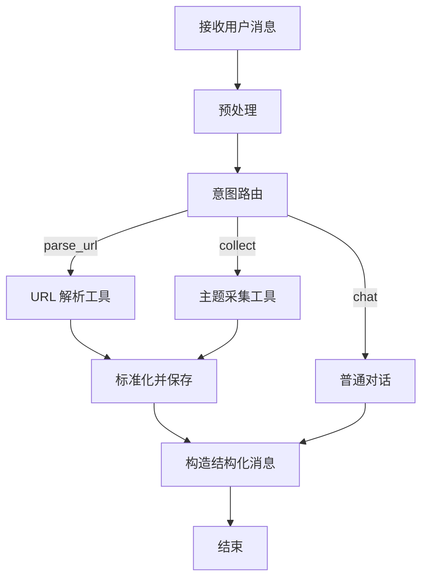
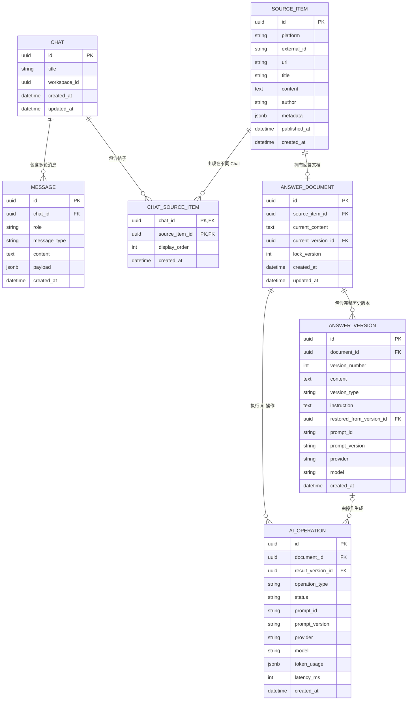
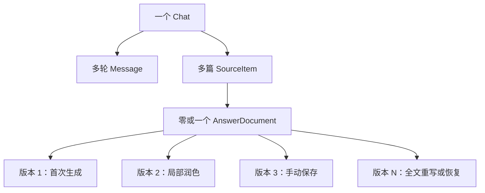

# Chat-first 内容创作 Agent：技术架构设计

**版本：** 1.0  
**日期：** 2026-07-10  
**状态：** 架构设计已确认，等待实现计划

## 1. 项目定位

本项目是一个个人本地运行的 Chat-first 内容采集与创作工具。用户通过单一聊天界面完成普通对话、主题采集和 URL 解析；从结果中选择帖子后，在右侧编辑区生成回答、手动编辑、局部润色并管理历史版本。

旧项目仅作为业务能力来源。已经稳定的平台采集器、解析器和回答服务可以迁移或包装复用，但新项目的 UI、API、Agent、状态模型、数据模型和模块边界重新设计。

### 1.1 第一阶段目标

- 只保留 `/chat` 核心页面。
- 支持普通多轮对话。
- 支持自然语言主题采集。
- 支持直接粘贴 URL 并解析。
- 支持小红书、知乎、Reddit、GitHub、V2EX 等现有平台能力。
- 一个 Chat 可以包含多次采集结果和多篇帖子。
- 点击不同帖子时，右侧显示各自独立的回答文档。
- 支持首次生成、手动编辑、局部 AI 润色和完整历史版本。
- 第一版只接入 DeepSeek，但模型层支持扩展多个供应商。
- 所有提示词使用 YAML 文件集中管理。

### 1.2 明确不做

- 不做多个角色互相讨论的 Multi-Agent。
- 不做批量回答生成。
- 不做自动发布。
- 不做团队协作和实时协同编辑。
- 不做版本 Diff、Patch、分支或合并。
- 不引入向量数据库、Kafka 或微服务。
- 第一版不要求 Redis 和 Celery。

## 2. 核心架构决策

采用“单编排 Agent + 确定性业务工作流 + 可插拔能力”的模块化单体架构。



核心原则：

1. 自然语言意图由 Agent 判断。
2. 按钮点击等明确操作直接调用确定性 API，不再让模型猜测。
3. 平台采集和 URL 解析属于工具，不属于独立 Agent。
4. 回答生成和局部润色属于独立业务工作流，不塞入 Chat Agent 的长期上下文。
5. Agent 不直接写 Document 或 AnswerVersion 表，持久化必须经过 Application Service。
6. 领域数据以 PostgreSQL 为事实来源；LangGraph checkpoint 只保存执行状态，不代替业务数据库。

## 3. 技术栈

| 层级 | 技术 | 责任 |
|---|---|---|
| 前端 | Next.js、React、TypeScript | Chat-first UI |
| UI | Tailwind CSS、shadcn/ui | 侧边栏、卡片、弹窗和布局 |
| 服务端状态 | TanStack Query | 查询、缓存、请求失效 |
| 临时 UI 状态 | Zustand | 当前 Chat、当前选中帖子、面板和选区 |
| 编辑器 | Tiptap 或 Milkdown | Markdown 编辑与选区能力 |
| 后端 | Python 3.12、FastAPI | REST API 和 SSE |
| Agent | LangGraph Graph API | 意图路由、工具编排、checkpoint |
| 数据模型 | Pydantic v2 | API、Agent State、工具契约 |
| ORM | SQLAlchemy 2 | 持久化访问 |
| 数据库 | PostgreSQL | Chat、帖子、文档、版本和调用记录 |
| 数据迁移 | Alembic | Schema 版本管理 |
| HTTP | HTTPX | 异步调用模型与采集器 |
| Prompt | YAML、Jinja2 StrictUndefined | 提示词注册、校验和渲染 |
| 工程工具 | uv、Ruff、Pyright | 依赖、格式和类型检查 |
| 测试（低优先级） | pytest、pytest-asyncio | 只覆盖核心路径和高风险逻辑 |

采用 PostgreSQL 而不是把 SQLite 作为主方案，是为了获得一致的 JSON、事务、并发控制和未来多用户扩展能力。个人本地运行可以通过 Docker Compose 启动 PostgreSQL。

## 4. 前端状态与交互

### 4.1 三类状态必须分离

**持久化 Chat 状态：** Chat、Message、采集结果、解析结果和帖子。

**持久化 Document 状态：** 当前完整回答、历史完整版本、AI 调用记录。

**前端临时状态：** 当前选中帖子、右侧创作区的内容状态、编辑器选区、悬浮润色框。

`selected_source_item_id` 只保存在 Zustand 内存中：

- 切换 Chat 后立即清空。
- 刷新页面后清空。
- 不保存到数据库。
- 不写入 URL。
- 切回原 Chat 时不会自动恢复选择，必须重新点击帖子。

帖子对应的 AnswerDocument 会持久保存。重新点击帖子后，右侧重新加载最新内容和版本历史。

### 4.2 右侧面板状态

| 条件 | 面板行为 |
|---|---|
| 未选择帖子 | 显示右侧空状态，引导用户从对话结果中选择帖子 |
| 选择没有回答的帖子 | 展示参考内容和“开始生成” |
| 选择已有回答的帖子 | 展示最新完整回答 |
| 点击同一 Chat 中另一帖子 | 切换对应 Document |
| 切换 Chat | 清空选择，右侧恢复空状态 |
| 刷新页面 | 清空选择，右侧恢复空状态 |

## 5. Chat Agent 设计

### 5.1 为什么采用单 Agent

聊天、意图识别和工具选择需要模型推理；具体平台采集、URL 解析、保存和版本更新都是确定性操作。将每个能力都包装成 Agent 会增加模型调用、延迟、上下文体积和错误路径，因此只保留一个主 Chat Agent。

### 5.2 Agent State

```python
class ChatAgentState(TypedDict):
    chat_id: str
    user_message_id: str
    messages: Annotated[list[AgentMessage], add_messages]
    intent: Literal["chat", "parse_url", "collect"] | None
    extracted_urls: list[str]
    collection_request: CollectionRequest | None
    tool_result: ToolResult | None
    response_payload: ChatResponsePayload | None
    error: AgentError | None
```

State 只保存本次图运行需要的数据，不保存：

- 当前选中帖子。
- 编辑器内容。
- 历史版本。
- 完整平台凭证。
- 所有历史采集帖子的全文。

长内容和结构化业务结果保存到 PostgreSQL，State 中只保留 ID 或本次运行所需的受限数据。

### 5.3 Graph 节点



节点职责：

- `preprocess`：确定性检测 URL、清理输入、建立请求上下文。
- `route_intent`：优先使用规则判断明显 URL；其余使用结构化 LLM 输出判断 `chat/collect`。
- `chat`：普通多轮对话并流式返回文本。
- `parse_url`：通过 Source Registry 找到对应平台适配器。
- `collect`：根据采集条件选择一个或多个适配器。
- `normalize_and_persist`：去重、标准化并保存 SourceItem。
- `build_response`：产生稳定的前端消息协议。

### 5.4 不经过 Agent 的命令

以下操作由前端直接调用确定性 API：

- 点击帖子并加载回答。
- 开始生成回答。
- 自动保存手动编辑。
- 局部润色。
- 手动保存版本。
- 查看或恢复历史版本。
- 复制内容。

## 6. 多平台 Content Source 插件体系

### 6.1 统一接口

```python
class ContentSource(Protocol):
    key: str

    def can_handle_url(self, url: str) -> bool: ...

    async def parse_url(
        self, request: ParseUrlRequest, context: ToolContext
    ) -> SourceItemDTO: ...

    async def collect(
        self, request: CollectionRequest, context: ToolContext
    ) -> list[SourceItemDTO]: ...
```

如果某个平台只支持解析或只支持采集，应通过 capability 显式声明，而不是提供一个运行后才报错的空实现。

### 6.2 Source Registry

Registry 负责：

- 注册小红书、知乎、Reddit、GitHub、V2EX 等适配器。
- 根据 URL 选择适配器。
- 根据采集请求和 capability 选择平台。
- 统一超时、重试、限速和错误类型。
- 将旧项目功能包装成适配器。

Agent 只能看见统一工具，例如 `parse_content_url` 和 `collect_topic`，不直接依赖具体平台类。

### 6.3 标准化结果

```python
class SourceItemDTO(BaseModel):
    external_id: str | None
    platform: str
    url: str
    title: str
    content: str
    author: str | None
    summary: str | None
    metrics: dict[str, int | float | str]
    published_at: datetime | None
    raw_metadata: dict[str, Any]
```

数据库以 `(platform, external_id)` 为首选去重键；没有稳定 external ID 时使用规范化 URL。

## 7. 回答文档与完整版本

### 7.1 核心规则

- 一篇 SourceItem 最多对应一个 AnswerDocument。
- AnswerDocument 保存当前最新工作内容。
- AnswerVersion 保存某个时间点的完整回答快照。
- 不计算或保存 Diff、Patch。
- 不支持版本分支与合并。
- 恢复版本时用旧版本全文替换当前全文，并生成一个新的完整版本。

### 7.2 AnswerDocument

```text
id
source_item_id              UNIQUE
current_content             TEXT
current_version_id          NULLABLE
lock_version                INTEGER
created_at
updated_at
```

`lock_version` 用于乐观锁。自动保存和 AI 润色请求都必须携带 `expected_lock_version`，不一致时返回 `409 Conflict`，避免慢请求覆盖新内容。

### 7.3 AnswerVersion

```text
id
document_id
version_number
content                     TEXT（完整内容）
version_type                ENUM
instruction                 NULLABLE
restored_from_version_id    NULLABLE
prompt_id                   NULLABLE
prompt_version              NULLABLE
provider                    NULLABLE
model                       NULLABLE
created_at
```

`version_type`：

- `initial_generation`
- `inline_refinement`
- `full_rewrite`
- `manual_checkpoint`
- `restored`

### 7.4 版本创建规则

| 操作 | 更新 Document | 创建完整版本 |
|---|---:|---:|
| 用户手动输入并自动保存 | 是 | 否 |
| AI 首次生成 | 是 | 是 |
| AI 局部润色 | 是 | 是 |
| AI 全文重写 | 是 | 是 |
| 用户点击保存版本 | 是 | 是 |
| 恢复历史版本 | 是 | 是 |
| 复制内容 | 否 | 否 |

### 7.5 局部润色流程

前端提交当前文档版本、选区和指令：

```json
{
  "expected_lock_version": 12,
  "selection": {
    "from": 135,
    "to": 228,
    "text": "选中的原始内容"
  },
  "instruction": "改得更自然一些"
}
```

后端流程：

1. 校验 `lock_version`。
2. 校验选区位置与选中文字仍然匹配。
3. 向模型提供选中文字、必要前后文和用户指令。
4. 模型只返回替换文本，不返回全文。
5. 后端以确定性代码将替换文本合成到当前全文。
6. 在同一数据库事务中创建完整 AnswerVersion 并更新 AnswerDocument。
7. 返回完整新内容、新版本信息和新的 `lock_version`。

局部仅代表 AI 修改范围；历史版本始终存储完整回答。

### 7.6 恢复流程

恢复版本 2 时，不删除后续版本：

1. 读取版本 2 的完整内容。
2. 创建新的 `restored` 版本。
3. 新版本完整内容等于版本 2。
4. `restored_from_version_id` 指向版本 2。
5. 更新 Document 当前内容和当前版本。

## 8. Prompt 管理

### 8.1 目录

```text
backend/
├── prompts/
│   ├── chat/
│   │   ├── system.yml
│   │   └── intent_router.yml
│   ├── collection/
│   │   ├── query_rewrite.yml
│   │   └── result_summary.yml
│   ├── parsing/
│   │   └── content_normalization.yml
│   ├── writing/
│   │   ├── answer_generate.yml
│   │   └── answer_rewrite.yml
│   ├── refinement/
│   │   └── inline_refine.yml
│   └── shared/
│       ├── style_rules.yml
│       └── safety_rules.yml
└── src/app/prompts/
    ├── loader.py
    ├── registry.py
    ├── schemas.py
    └── errors.py
```

### 8.2 YAML Schema

```yaml
id: refinement.inline_refine
version: "1.0.0"
description: 根据指令重写选中内容

model:
  profile: creative
  temperature: 0.6
  max_tokens: 2000

variables:
  required:
    - selected_text
    - context_before
    - context_after
    - instruction

includes:
  style_rules: shared.style_rules

messages:
  - role: system
    content: |
      你负责局部文字润色，只返回用于替换选区的新文字。
      {{ style_rules }}

  - role: user
    content: |
      前文：{{ context_before }}
      选中文字：{{ selected_text }}
      后文：{{ context_after }}
      修改要求：{{ instruction }}
```

### 8.3 Prompt Registry 责任

- 扫描并注册 YAML。
- 使用 Pydantic 校验 Schema。
- 检测重复 Prompt ID 和循环引用。
- 检查必填变量。
- 使用 Jinja2 `StrictUndefined` 渲染。
- 解析共享片段。
- 合并模型 profile 参数。
- 返回统一的 messages 和模型参数。
- 开发环境支持热加载；生产模式启动时加载并冻结。

业务代码只通过稳定 ID 调用：

```python
rendered = prompt_registry.render(
    "refinement.inline_refine",
    selected_text=selection.text,
    context_before=context.before,
    context_after=context.after,
    instruction=request.instruction,
)
```

禁止在 Agent Node、Workflow 或 Service 中直接编写长提示词。

## 9. 多模型 Provider

### 9.1 接口

```python
class LLMProvider(Protocol):
    key: str

    async def generate(self, request: LLMRequest) -> LLMResponse: ...

    async def stream(
        self, request: LLMRequest
    ) -> AsyncIterator[LLMStreamEvent]: ...
```

第一版实现 `DeepSeekProvider`。Agent 和 Workflow 只依赖 `LLMProviderRegistry`，不引用 DeepSeek SDK 或专有响应类型。

### 9.2 Model Profile

```yaml
model_profiles:
  default:
    provider: deepseek
    model: deepseek-chat

  creative:
    provider: deepseek
    model: deepseek-chat

  reasoning:
    provider: deepseek
    model: deepseek-reasoner
```

Prompt 引用 profile，不写死供应商。未来新增供应商时只增加 Provider Adapter 和配置。

## 10. 数据模型

### 10.1 核心实体关系



业务关系可以简化为：



准确的领域表达是：

> 一个 Chat 包含多轮对话和多篇帖子；一篇帖子最多拥有一个回答文档；一个回答文档包含多个完整回答版本。

各层职责：

| 实体 | 保存什么 |
|---|---|
| `Chat` | 一次连续的聊天和创作上下文 |
| `Message` | 用户消息、AI 回复和结构化工具结果 |
| `SourceItem` | 从平台采集或 URL 解析得到的原始帖子 |
| `ChatSourceItem` | Chat 与帖子之间的关联及展示顺序 |
| `AnswerDocument` | 编辑器当前最新工作内容 |
| `AnswerVersion` | 重要创作节点的完整回答快照 |
| `AIOperation` | 一次生成、润色或重写任务的执行记录 |

### 10.2 Chat 与 Message

一个 Chat 包含多条 Message。每一次用户输入、AI 回复或工具结果都是独立消息。Message 通过 `message_type` 区分普通文本、帖子卡片、帖子列表、工具状态和错误。

### 10.3 Chat 与 SourceItem

Chat 和 SourceItem 使用多对多关系。同一篇帖子可能在不同 Chat 中通过主题采集或 URL 解析被重复发现，因此帖子本身只保存一份，不直接持有 `chat_id`；`chat_source_items` 负责关联它们。

去重后的同一 SourceItem 可以出现在多个 Chat 中，但所有 Chat 看到的是同一篇帖子以及同一个 AnswerDocument。第一阶段这是个人工具所期望的行为，避免针对同一帖子生成多套互不关联的回答。

### 10.4 SourceItem、AnswerDocument 与 AnswerVersion

帖子刚被采集时可能还没有生成回答，因此 SourceItem 与 AnswerDocument 是 `1 → 0..1`。用户第一次点击“开始生成”后创建 AnswerDocument。

AnswerDocument 保存编辑器当前显示的最新内容，其中可能包含尚未手动保存成正式版本的人工修改；AnswerVersion 保存首次生成、局部润色、全文重写、手动保存或恢复操作产生的完整快照。

不直接建立“帖子包含多个回答文本”的结构，是因为系统还需要保存用户正在编辑、但尚未形成正式版本的工作内容。为此必须保留中间的 AnswerDocument：

```text
SourceItem
└── AnswerDocument.current_content        当前工作内容
    ├── AnswerVersion 1                   首次生成的完整回答
    ├── AnswerVersion 2                   局部润色后的完整回答
    └── AnswerVersion N                   后续完整版本
```

### 10.5 主要数据表

主要表：

| 表 | 用途 |
|---|---|
| `chats` | Chat 元数据 |
| `messages` | 用户、AI、工具和结构化消息 |
| `collection_runs` | 一次主题采集请求及状态 |
| `source_items` | 标准化帖子或 URL 内容 |
| `chat_source_items` | Chat 与帖子多对多关系及展示顺序 |
| `answer_documents` | 每篇帖子当前最新回答 |
| `answer_versions` | 完整回答历史快照 |
| `ai_operations` | 模型调用任务、状态、Prompt 和用量 |
| `app_settings` | 本地应用非敏感设置 |

即使第一版是单用户，也为主要业务表预留 `workspace_id`，但不实现注册、RBAC 或复杂租户逻辑。

### 10.6 Message 内容协议

Message 不能只保存 Markdown 字符串，应保存稳定类型：

```text
text
source_card
source_list
tool_status
error
```

`messages.payload` 使用 JSONB 保存结构化数据，但只保存 SourceItem ID 和展示字段，完整正文仍从 `source_items` 读取，避免数据重复。

### 10.7 AI Operation

```text
id
chat_id                    NULLABLE
document_id                NULLABLE
operation_type
status                     pending/running/completed/failed/cancelled
prompt_id
prompt_version
provider
model
model_parameters           JSONB
input_metadata             JSONB
result_version_id          NULLABLE
input_tokens               NULLABLE
output_tokens              NULLABLE
latency_ms                 NULLABLE
error_code                 NULLABLE
error_message              NULLABLE
created_at
completed_at               NULLABLE
```

只有模型完整返回并通过校验后，才在事务中创建 AnswerVersion。失败操作不会产生残缺版本。

## 11. API 与 SSE

### 11.1 REST API

```text
POST   /api/chats
GET    /api/chats
GET    /api/chats/{chat_id}
DELETE /api/chats/{chat_id}

GET    /api/chats/{chat_id}/messages
POST   /api/chats/{chat_id}/messages/stream

GET    /api/source-items/{source_item_id}

GET    /api/source-items/{source_item_id}/document
POST   /api/source-items/{source_item_id}/document/generate
PUT    /api/documents/{document_id}
POST   /api/documents/{document_id}/refine
POST   /api/documents/{document_id}/rewrite

GET    /api/documents/{document_id}/versions
POST   /api/documents/{document_id}/versions
POST   /api/documents/{document_id}/versions/{version_id}/restore

GET    /api/settings
PUT    /api/settings
```

### 11.2 SSE 事件协议

聊天和 AI 生成使用 SSE 单向流。第一版没有服务端主动协作消息，因此不需要 WebSocket。

```text
run.started
agent.status
message.delta
tool.started
tool.progress
source.created
source.list.completed
document.delta
document.completed
run.failed
run.completed
```

每个事件包含：

```json
{
  "event_id": "evt_123",
  "run_id": "run_123",
  "type": "message.delta",
  "sequence": 12,
  "data": {}
}
```

`run_id + sequence` 用于前端去重和保持顺序。连接中断后，前端重新读取数据库中的最终状态；第一版不要求从 token 级断点继续。

## 12. 异步任务策略

第一版采用进程内异步执行和数据库任务记录：

- 短任务直接在请求生命周期内流式执行。
- 采集与生成状态写入 `collection_runs` 或 `ai_operations`。
- 所有外部调用设置超时和有限重试。
- 业务写入使用幂等键，避免重试产生重复帖子或版本。

定义抽象 `TaskDispatcher`：

```python
class TaskDispatcher(Protocol):
    async def submit(self, task: ApplicationTask) -> TaskHandle: ...
```

第一版实现 `InProcessTaskDispatcher`。未来需要多进程或部署到服务器时，可替换为 Dramatiq、Celery 或其他队列，而不修改 Application Service。

FastAPI `BackgroundTasks` 不用于关键的长任务，因为进程退出后无法保证恢复。

## 13. 后端目录结构

```text
backend/
├── pyproject.toml
├── alembic.ini
├── prompts/
├── migrations/
├── tests/
│   ├── unit/
│   ├── integration/
│   ├── contract/
│   └── fixtures/
└── src/app/
    ├── main.py
    ├── config.py
    ├── api/
    │   ├── dependencies.py
    │   ├── errors.py
    │   └── routes/
    ├── agents/
    │   └── chat/
    │       ├── graph.py
    │       ├── state.py
    │       ├── nodes.py
    │       └── routing.py
    ├── application/
    │   ├── chat_service.py
    │   ├── document_service.py
    │   ├── collection_service.py
    │   └── version_service.py
    ├── domain/
    │   ├── chat/
    │   ├── content/
    │   └── document/
    ├── workflows/
    │   ├── answer_generation.py
    │   ├── inline_refinement.py
    │   └── full_rewrite.py
    ├── sources/
    │   ├── base.py
    │   ├── registry.py
    │   └── adapters/
    ├── llm/
    │   ├── base.py
    │   ├── registry.py
    │   └── providers/deepseek.py
    ├── prompts/
    ├── persistence/
    │   ├── models/
    │   ├── repositories/
    │   ├── session.py
    │   └── uow.py
    ├── streaming/
    ├── tasks/
    └── observability/
```

依赖方向：

```text
API → Application → Domain
Agent/Workflow → Application ports
Persistence/Provider/Source Adapter → Application ports
```

Domain 层不依赖 FastAPI、LangGraph、SQLAlchemy 或具体模型供应商。

## 14. 错误处理

统一错误分类：

- `ValidationError`：用户输入或 Prompt 变量错误。
- `UnsupportedSourceError`：不支持的平台或 URL。
- `SourceAuthError`：平台凭证失效。
- `SourceRateLimitError`：平台限流。
- `SourceUnavailableError`：页面或采集服务不可用。
- `LLMRateLimitError`：模型限流。
- `LLMOutputError`：模型输出未通过结构校验。
- `DocumentConflictError`：`lock_version` 冲突。
- `OperationTimeoutError`：任务超时。

前端收到稳定的 `error_code` 和可读信息，不展示堆栈或供应商原始错误。外部调用只对超时、限流和临时服务错误执行有限指数退避；验证失败和权限错误不自动重试。

## 15. 安全与隐私

- API Key 不写入 Prompt、Agent State、消息或普通日志。
- 本地凭证优先使用环境变量或系统安全存储。
- Prompt 调用记录默认只保存 Prompt ID、版本和输入摘要，不保存完整渲染 Prompt。
- URL 抓取需阻止访问本机、内网和云元数据地址，防止 SSRF。
- 对抓取正文设置长度、类型和超时限制。
- 平台原始内容和规范化内容分开保存，必要时可重新解析。

## 16. 可观测性

每次 Chat Graph 和 AI Workflow 使用统一 `run_id`，记录：

- 节点或操作名称。
- 开始和结束时间。
- Prompt ID 与版本。
- Provider 与模型。
- Token 用量和耗时。
- 工具调用结果数量。
- 失败类型和重试次数。

先实现标准结构化日志和数据库 operation 记录；未来可通过独立 adapter 接入 LangSmith 或 OpenTelemetry。

## 17. 测试策略（低优先级）

当前项目精力和预算有限，第一阶段以核心功能可用和交互闭环为主，不追求高覆盖率，也不为每个模块建立完整测试套件。测试只保护最容易造成数据丢失、错误覆盖或主流程中断的高风险逻辑，其余功能优先通过人工验收。

### 17.1 第一阶段最小测试范围

- Prompt YAML 能正常加载，缺少必填变量时能够明确报错。
- Source Registry 可以根据 URL 选择正确的平台适配器。
- 局部润色能够把新文本合成到正确选区，并保存完整版本。
- AnswerVersion 恢复后产生新的完整版本，不删除历史记录。
- `lock_version` 冲突时返回 409，不静默覆盖最新内容。
- 一条端到端冒烟测试覆盖“发送采集指令 → 返回帖子列表 → 选择帖子 → 生成回答”。

### 17.2 后续按需补充

当某个模块频繁修改、出现过线上缺陷，或准备从个人版升级为多人在线服务时，再补充以下测试：

- Intent Router 结构化输出与 fallback。
- 每个平台适配器使用相同测试套件。
- 每个 LLM Provider 返回统一响应和流事件。
- SSE 事件符合固定 Schema 和顺序规则。
- 用户消息 → Agent 路由 → 假采集器 → Source List Message。
- URL → 解析器 → SourceItem → 卡片消息。
- 生成回答 → Version 1 → Document 更新。
- 局部润色 → 全文合成 → Version 2。
- 恢复旧版本 → 新 restored 版本。
- 自动保存与润色并发 → 其中一个得到 409，而不是静默覆盖。

需要测试模型或外部平台交互时，默认使用 fake adapter，避免自动化测试依赖网络和产生模型费用。真实平台和真实模型通过少量人工验收确认。

## 18. 扩展路径

### 新增平台

实现 `ContentSource`，声明 capability，注册到 Source Registry；不修改 Agent Graph。

### 新增模型供应商

实现 `LLMProvider`，添加模型 profile；不修改 Prompt 和 Workflow。

### 新增创作能力

增加独立 Prompt、Workflow 和 API command；只有确实需要自然语言选择时才修改 Agent Router。

### 从个人版升级多用户

增加认证、Workspace、Repository 查询隔离和凭证归属；保留现有领域模型与插件接口。

### 从单进程升级队列

替换 `TaskDispatcher`，保留 `ai_operations`、幂等键和 SSE 事件协议。

## 19. 推荐实施顺序

1. 建立项目骨架、配置、数据库和统一 Schema。
2. 实现 Chat、Message、SourceItem 和结构化消息协议。
3. 实现 Prompt Registry 与 DeepSeek Provider。
4. 实现 LangGraph Chat Agent 和 SSE。
5. 建立 ContentSource Registry，迁移一个最简单平台作为参考实现。
6. 迁移其余平台适配器。
7. 实现 AnswerDocument、完整 AnswerVersion 和乐观锁。
8. 实现回答生成、自动保存和局部润色。
9. 实现历史版本列表、完整预览和全文恢复。
10. 完善错误处理和可观测性，并补充最小核心路径测试。

## 20. 验收标准

- 用户可以在同一 Chat 连续聊天、采集和解析 URL，已有消息不被工具结果替换。
- 多平台结果使用统一的 SourceItem 数据结构和前端组件。
- 同一 Chat 可以包含多篇帖子，每篇帖子拥有独立 Document。
- 未选择帖子时右侧显示空状态；点击帖子后展示对应创作区；切换 Chat 或刷新后恢复为空状态。
- AI 首次生成、局部润色、全文重写、手动保存和恢复都会创建完整历史版本。
- 手动编辑自动保存，但不会产生大量历史版本。
- 恢复版本采用全文替换，不计算 Diff。
- Prompt 不散落在 Python 文件中，所有 YAML 在启动和测试阶段可校验。
- Agent 与 Workflow 不依赖 DeepSeek 专有类型。
- 新增平台或模型不需要修改核心 Agent 主流程。
