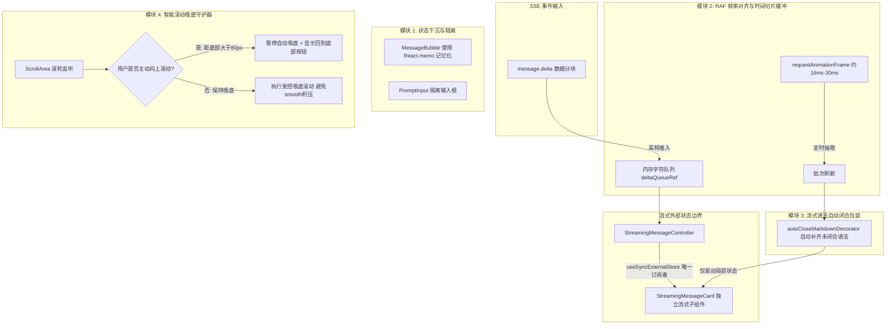

# Chat 主线流式渲染瓶颈深度分析与优化实施方案

> **文件归属**：`docs/chat-stream-rendering-optimization-plan.md`  
> **目标模块**：前端对话主工作区（`frontend/src/features/chat/chat-panel.tsx` 及关联组件）  
> **核心目标**：彻底解决 SSE 流式打字机过程中的全量重渲染、AST 重复解析高负载、布局闪烁跳变与抢滚动条问题。

---

## 1. 现状痛点与性能瓶颈定位

通过对 `frontend/src/features/chat/chat-panel.tsx` 的代码审查与性能链路追踪，当前打字机渲染存在以下 4 个瓶颈点：

### 1.1 顶层状态导致的级联过度渲染（Re-render Cascade）
- **代码位置**：`chat-panel.tsx:L157-L162`
- **问题分析**：`streamingText`、`agentStatus`、`streamingSourceList` 等高频流式状态声明在拥有 1000 多行代码的 `ChatPanel` 根组件中。
- **影响**：SSE 流式推流期间，LLM 每秒返回 20~50 个 `message.delta` token。每次调用 `setStreamingText` 都会触发整个 `ChatPanel` 的重新执行，导致无状态变化的已有历史消息列表（`activePath.map` 中的多条 `<MessageBubble>`）、底部输入框 `<PromptInput>` 以及状态栏被迫全量“陪跑”重渲染。

### 1.2 高频逐 Chunk 触发的 AST 全量重新解析（$O(N^2)$ 累计开销）
- **代码位置**：`chat-panel.tsx:L627-L633`
- **问题分析**：`<MarkdownContent>` 内部的 `unified` / `remark` / `rehype` / `KaTeX` 解析器是无状态全量解析。
- **影响**：第 10 个字符时解析 10 个字符；生成至第 2000 字符时，每追加 1 个字符都会把前面 2000 个字符全量重新分词、构建语法树、提取数学公式并做 XSS 过滤。长回复时 CPU 负载呈指数级上升，低端设备或移动端会出现明显发热和打字掉帧。

### 1.3 未闭合语法导致的视觉跳动（Layout Shift & Flickering）
- **代码位置**：`components/ui/markdown-content.tsx`
- **问题分析**：流式生成过程中，代码块（```` ```ts ````）、数学公式（`$$`）、加粗（`**`）或表格行（`|`）往往处于“半闭合”状态。
- **影响**：在收到闭合标记前，解析器将其作为普通文本渲染；后半段闭合标记到来的瞬间突变为代码框或公式，导致容器高度和样式瞬间突变，产生明显的闪烁与视觉跳动。

### 1.4 强行吸底的“抢滚动条”冲突（Scroll Fighting）
- **代码位置**：`chat-panel.tsx:L276-L278`
- **问题分析**：`useEffect([..., streamingText])` 在每次文本更新时无条件触发 `messagesEndRef.current?.scrollIntoView({ behavior: "smooth" })`。
- **影响**：用户若在 Agent 输出时长篇大论时尝试向上滑轮查看刚才的历史提问，每隔几十毫秒就会被强行拉回底部，无法查看历史；且每秒几十次触发带动画的 `smooth` 滚动会在浏览器主线程积压大量未决微任务。

---

## 2. 优化方案四大核心架构设计

针对上述瓶颈，设计四大模块进行分层治理：



---

### 方案 1：状态下沉与组件细粒度隔离（State Colocation & Component Isolation）

1. **抽离独立流式卡片 `<StreamingMessageCard />`**：
   - 将流式打字机的临时 DOM 结构、状态指示器以及 Markdown 内容抽离为一个专职子组件。
   - `streamingText`、`agentStatus`、来源与错误统一放入 `StreamingMessageController`；`ChatPanel` 只写入 SSE 事件、不订阅流式快照。
   - `<StreamingMessageCard />` 通过 `useSyncExternalStore` 成为唯一订阅者，频繁变动仅驱动该卡片重渲染，完全切断对父组件 `ChatPanel` 的渲染扩散。
   - 控制器独立于卡片挂载周期，首次创建会话、路由切换和卡片暂未挂载时也不会丢失已经到达的事件。
2. **对已有历史消息应用 `React.memo`**：
   - 为 `<MessageBubble>` 封装记忆化对比函数，只要消息的 `messageId`、`content`、`messageType`、`isEditing` 以及兄弟分支索引不变，流式期间跳过重渲染。
3. **底部输入框隔离**：
   - 保证用户在 Agent 流式生成期间在输入框键入文字时，输入体验丝滑流畅，绝不掉帧。

---

### 方案 2：基于 RAF 的时间切片分批缓冲（Buffered Chunking via RAF）

1. **核心机制**：
   - 收到 `message.delta` 时不再直接调用 React `setState`。
   - 将字符 chunk push 到内存缓冲队列 `chunkBufferRef` 中。
2. **帧率对齐（16.7ms ~ 33ms 一刷新）**：
   - 利用 `requestAnimationFrame`（约 30~60 FPS）调度一次批量刷新。
   - 将每秒 30~60 次无序的 micro-renders 聚合为平稳的 30 FPS 批处理更新。
3. **流结束全量 Flush**：
   - 收到 `run.completed` 或连接断开时，立即强制清空并应用缓冲区剩余所有字符，保证不丢字。

---

### 方案 3：流式 Markdown 语法自动闭合容错（Auto-closing Markdown Decorator）

针对流式中途的语法断层，在将文本传递给 `<MarkdownContent>` 渲染前，通过轻量级正则状态机进行**虚拟闭合包装**：
1. **代码块围栏检查**：
   - 统计行首 ```` ``` ```` 的数量，若为奇数（说明代码块未闭合），在末尾补齐 `\n```\n`。
2. **LaTeX 数学公式检查**：
   - 检测末尾存在奇数个块级 `$$` 时，自动补齐对应的 `$$`，避免 KaTeX 报错或跳变。
3. **行内样式检查**：
   - 自动检测未闭合的 `**` 加粗符号。

---

### 方案 4：用户滚动感知与智能吸底守护（Smart Scroll & Pin-to-Bottom Guard）

1. **滚动位置感知**：
   - 监听 `ScrollArea` 的 Viewport 滚动事件：
     ```typescript
     const isNearBottom = scrollHeight - scrollTop - clientHeight <= 80;
     ```
   - 若用户主动往上翻阅（`!isNearBottom`），标记 `isUserScrolledUp = true`，**立即暂停吸底**。
   - 若用户重新滑动到接近底部（`isNearBottom`），恢复 `isUserScrolledUp = false`。
2. **停止 smooth 滚动队列积压**：
   - 在流式高频期间，将 `behavior: "smooth"` 改为即时滚动或 RAF 单帧滚动，避免浏览器连续执行平滑动画导致的“拖泥带水”与卡顿。
3. **“滚动到底部”快捷气泡**：
   - 当 `isUserScrolledUp === true` 且 Agent 正在输出时，在聊天区域右下角浮现带有新消息提示的小胶囊：`↓ 回到底部`，点击后瞬间回到底部并恢复自动跟踪。

---

## 3. 具体落地文件与实施改造计划

| 步骤 | 操作类型 | 文件路径 | 改造说明 |
|---|---|---|---|
| **Step 1** | **新建** | `frontend/src/features/chat/use-streaming-buffer.ts` | 实现可订阅的 RAF 流式文本缓冲器，提供 `appendChunk`、`flush`、`reset` 与稳定快照 |
| **Step 2** | **新建** | `frontend/src/features/chat/streaming-message-controller.ts` | 持有文本、Agent 状态、来源、错误和展示生命周期；不使用 `ChatPanel` React state |
| **Step 3** | **新建** | `frontend/src/features/chat/markdown-stream-decorator.ts` | 实现流式 Markdown 虚拟闭合装饰器，解决代码块和公式跳闪 |
| **Step 4** | **新建** | `frontend/src/features/chat/streaming-message-card.tsx` | 通过 `useSyncExternalStore` 独占订阅流式控制器，集成语法闭合与打字机输出 |
| **Step 5** | **修改** | `frontend/src/features/chat/chat-panel.tsx` | 1. SSE 仅写入控制器<br/>2. 为 `MessageBubble` 添加 `React.memo`<br/>3. 自动滚动改为卡片提交后的稳定回调<br/>4. 处理首次建会话和切换会话竞态 |
| **Step 6** | **测试验证** | `frontend/src/features/chat/streaming-state.test.ts`、`streaming-render.test.ts` | 验证缓冲合并、同步 Flush、挂载前事件保留、完整流式生命周期和 Markdown 自动闭合 |

---

## 4. 预期收益与验证指标

1. **CPU 占用率**：长文本（1500+ 字）流式输出期间，主线程 CPU 占用预期降低 **50% ~ 70%**。
2. **页面帧率（FPS）**：从流式生成过程中的 15~25 FPS 稳定恢复至 **55~60 FPS**。
3. **交互体验**：
   - 彻底告别“抢滚动条”现象，用户可在 Agent 输出时长文自由往上翻阅历史。
   - 彻底消除代码块与公式在打字过程中的闪烁突变。
