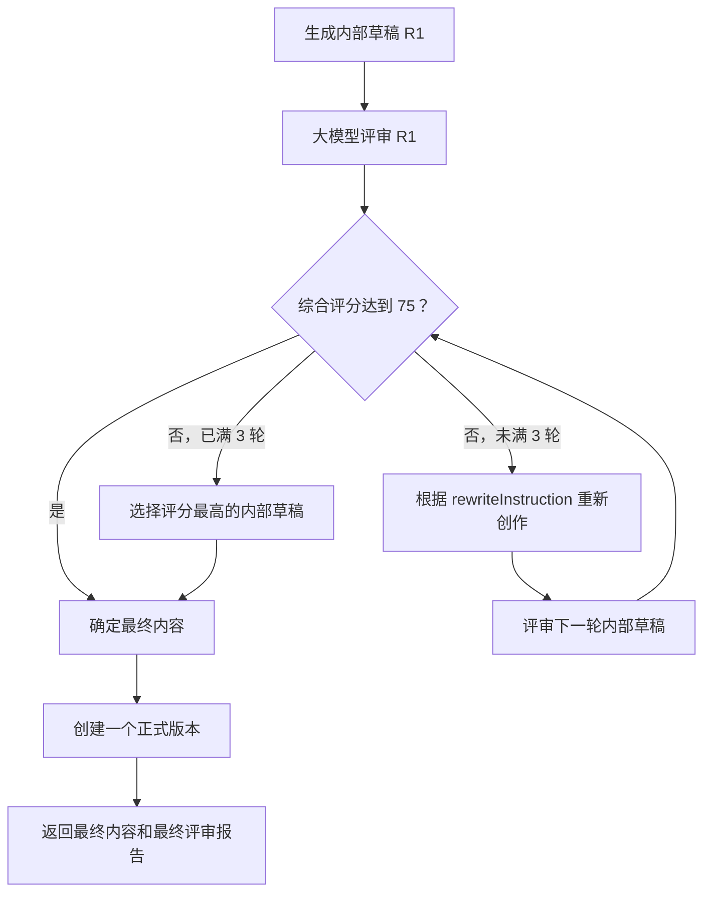

# 自动创作评审闭环设计

日期：2026-08-12

## 目标

每次 AI 创作完成后自动进行质量评审。未达到质量阈值时，系统根据评审建议自动重写并再次评审，最多进行三轮。内部草稿和评审轮次不进入历史版本；整个创作流程结束后只保存一个正式版本，并在页面展示最终内容及其评审结果。

## 核心规则

1. 一轮由“一份内部草稿 + 一次大模型评审”组成。
2. 首次生成计为第 1 轮，最多执行 3 轮。
3. 综合评分达到 `75` 时立即结束。
4. 未达到阈值且不足 3 轮时，使用本轮评审生成的 `rewriteInstruction` 重新创作。
5. 第 3 轮仍未达标时，从全部内部草稿中选择综合评分最高的一份作为最终内容；同分时选择轮次更晚的一份。
6. 内部草稿不创建 `AnswerVersion`，内部自动重写也不使用 `INLINE_REFINEMENT` 版本类型。
7. 流程结束后只调用一次版本创建逻辑，生成一个正式历史版本。
8. 用户主动编辑并保存、主动重新创作或恢复历史版本时，才按现有规则增加历史版本。

## 创作流程



`document.completed` 和 `run.completed` 必须在评审闭环结束、正式版本保存成功后发送。不能先宣布创作完成，再在后台追加自动精修版本。

## 统一评审契约

删除自动反思与手动质检之间的评分差异，统一使用 0～100 的结构化评审结果。系统使用以下核心字段：

```json
{
  "overallScore": 82,
  "dimensionScores": {
    "relevance": 85,
    "informationDensity": 80,
    "readability": 84,
    "logicCoherence": 81,
    "wordCountCompliance": 90
  },
  "issues": [
    {
      "severity": "major",
      "description": "第二部分的结论缺少事实支撑"
    }
  ],
  "suggestions": [
    "为第二部分补充具体数据或案例"
  ],
  "rewriteInstruction": "保留文章结构和已验证内容，重点补充第二部分的论据。",
  "summary": "文章已回答核心问题，但论据仍需加强。"
}
```

约束：

- 所有分数均为 0～100 的整数。
- `passed` 不由大模型输出，由系统按 `overallScore >= 75` 计算。
- 每个维度必须存在并通过结构化模型校验。
- `issues` 和 `suggestions` 必须具体、可执行。
- 未达标时 `rewriteInstruction` 必填；达标时系统将其忽略。
- 自动闭环不依赖片段级 `qualitySuggestions`，避免把“逐条人工采纳”混入自动重写流程。

## 评审提示词

自动评审统一使用 `prompts/review/quality_review.yml` 中的
`review.quality_review`。现有 `writing.reflection` 不再参与创作流程，避免继续维护
0～1 与 0～100 两套评分协议。

评审提示词必须接收以下上下文：

- `question`：用户原始问题或来源问题标题。
- `content`：本轮完整内部草稿。
- `styleRules`：本次创作使用的风格要求。
- `targetWordCount`：目标字数。
- `iteration`：当前轮次。
- `previousReview`：上一轮评审结果；第 1 轮为空。

系统提示词要求：

```text
你是内容质量评审员，只负责评审，不直接重写文章。

请结合用户原始问题、目标风格、目标字数和当前文章进行独立评审。
按相关性、信息密度、可读性、逻辑连贯性、字数合规性五个维度评分，
每项和综合分均为 0～100 的整数。

评分不能因文章更长而提高。问题描述必须指出具体位置或具体缺陷，建议必须可执行。
如果综合分可能低于 75，必须给出 rewriteInstruction，说明下一轮应保留什么、修改什么，
禁止要求无关的全文重写。只输出符合给定 schema 的 JSON，不输出 Markdown 或解释文字。
```

用户提示词按以下顺序提供上下文：

```text
原始问题：{{ question }}
目标字数：{{ targetWordCount }}
风格要求：{{ styleRules }}
当前轮次：{{ iteration }}/3
上一轮评审：{{ previousReview }}

待评审文章：
{{ content }}
```

重写阶段接收原始创作上下文、当前草稿和 `rewriteInstruction`。提示词必须要求保留已经正确的内容，只修改评审指出的问题，避免每轮无目的地完全重写。

## 后端职责

### 自动评审编排器

编排器负责：

1. 接收初始内部草稿及完整创作上下文。
2. 调用统一结构化评审服务。
3. 根据系统阈值决定结束或重写。
4. 保留每轮 `{content, report, iteration}`，用于三轮未达标时选出最高分草稿。
5. 返回最终内容、最终报告、实际轮数、是否达标和选中轮次。

编排器不创建、修改或恢复 `AnswerVersion`。

### 生成接口

生成接口的顺序调整为：

1. 生成初始内部草稿。
2. 执行自动评审编排器。
3. 创建一个正式 `AnswerVersion`。
4. 保存本次创作运行的全部评审记录。
5. 发送最终 `document.completed`。
6. 发送 `run.completed`。

原有在 `document.completed` 之后执行反思、再创建 `inline_refinement` 版本的逻辑必须移除。

## 评审记录与版本

- 每轮评审可以继续写入质量评分记录，但必须通过同一个创作操作标识关联。
- 评审记录保存轮次、分数、问题、建议、重写指令和是否被选为最终内容。
- 正式版本创建后，本次创作操作和最终评审报告关联到该版本。
- 历史版本查询只返回 `AnswerVersion`，因此无论内部执行一轮还是三轮，本次创作都只增加一个版本。
- 最终评审报告默认读取当前正式版本所关联的创作评审结果。

## SSE 事件

生成过程新增并统一处理以下事件：

| 事件 | 主要字段 | 用途 |
|---|---|---|
| `review.started` | `iteration`, `maxIterations` | 显示正在进行第几轮评审 |
| `review.completed` | `iteration`, `overallScore`, `passed` | 更新本轮评审进度 |
| `rewrite.started` | `iteration`, `maxIterations` | 显示正在根据建议优化 |
| `document.completed` | 文档状态、最终评审摘要 | 用最终内容替换编辑器内容 |
| `run.completed` | `runId` | 标记完整创作流程结束 |

内部重写内容不发送为新的历史版本。前端可以显示首次生成的流式文本，但收到 `document.completed` 时必须以最终选定内容覆盖编辑器。

## 前端修改

### 生成状态

创作按钮进入处理中状态后，根据 SSE 显示：

- 正在生成内容
- 正在进行第 1/3 轮评审
- 未达到质量阈值，正在根据建议优化
- 正在进行第 2/3 轮评审
- 创作完成

在收到 `run.completed` 前，创作按钮保持禁用；不能在首次文本流结束时提前恢复。

### 评审入口与结果

- 顶部“评审”按钮改为“查看评审”。
- 移除“开始质检”和手动触发评审的主流程入口。
- 弹窗默认展示当前正式版本的最终评审报告。
- 展示综合评分、五个维度评分、是否达到阈值、问题、建议和实际评审轮数。
- 可以展示内部评审历程，但历程只显示轮次与评分，不显示为文章历史版本，也不提供恢复操作。
- 完成事件到达后刷新评审查询和历史版本查询；历史版本数量本次只增加 1。

### 最终状态

若三轮仍未达标，页面明确显示“已完成 3 轮评审，当前为三轮中评分最高的结果”，同时展示最终问题和建议。

## 异常处理

- 单次结构化评审输出不合法时，沿用 LLM 客户端的结构化输出重试机制；重试不计入创作轮次。
- 某轮评审最终失败时停止自动重写，保存当前内部草稿为一个正式版本，并把评审状态标记为失败。
- 前端显示“内容已生成，但自动评审失败”，不重复创建版本，也不显示伪造分数。
- 正式版本保存失败时发送 `run.failed`，不得发送 `document.completed` 或 `run.completed`。

## 验收标准

1. 首轮评分达标时，只生成一个历史版本，并显示一轮评审结果。
2. 第 2 或第 3 轮达标时，仍只生成一个历史版本，正式内容等于达标草稿。
3. 三轮均未达标时，只生成一个历史版本，内容等于三轮最高分草稿。
4. 自动重写不得创建 `INLINE_REFINEMENT` 历史版本。
5. `document.completed` 和 `run.completed` 只在评审和最终版本保存之后发送。
6. 评审模型接收到原始问题、风格、字数和轮次，并返回统一的 0～100 结构化结果。
7. 前端能显示评审进度和最终报告，顶部入口显示“查看评审”。
8. 用户后续手动保存或重新创作时，才按现有规则增加新的历史版本。
