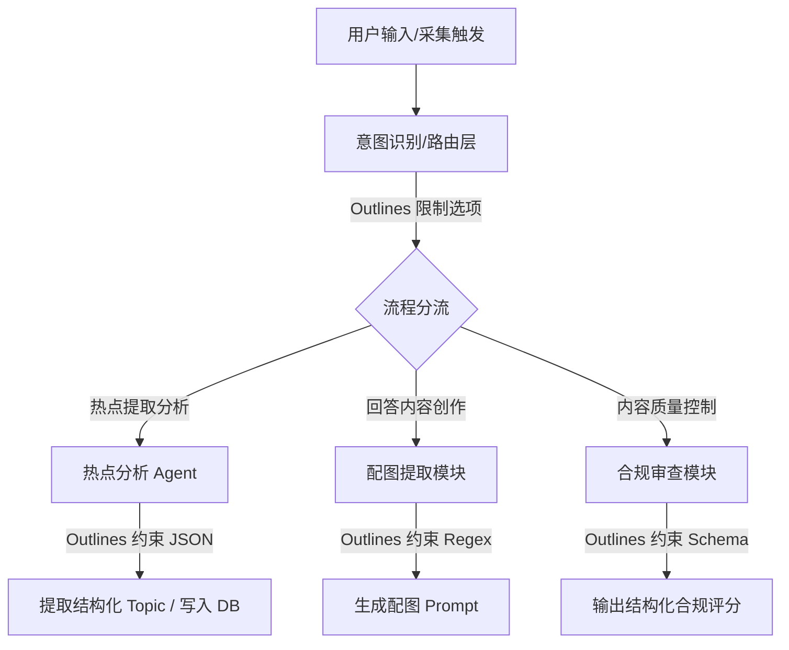

# Feature Specification: Outlines 受限解码与结构化输出集成

为了提升工作台 LLM 操作的确定性、降低 Agent 决策出错率，并实现 100% 格式合规的数据流，本方案拟在项目中集成 [Outlines](https://github.com/dottxt-ai/outlines)。本文档详细规定了 Outlines 的应用场景、系统架构与预期的输入输出格式规范。

---

## 1. 核心应用场景与集成点

目前工作台中共有 4 处核心链路需要集成 Outlines 以取代传统的“Prompt 约束 + 事后 JSON 解析”方案：



---

## 1.5 Pydantic 与 Outlines 的协同机制

在上述大部分受限生成场景中，**Pydantic** 与 **Outlines** 将结对协同工作：

* **Pydantic 的角色 (结构契约定义)**：使用 `BaseModel` 和 `Field` 来明确大模型必须输出的数据结构、字段类型限制（例如 `int` 范围、列表最大项数）以及面向 LLM 语义理解的字段描述。
* **Outlines 的角色 (受限解码执行)**：读取 Pydantic 模型的结构，在 LLM 逐字生成 token 时进行屏蔽干预，确保大模型吐出的数据结构 100% 贴合 Pydantic 定义。
* **开发收益**：生成流结束时，Outlines 直接返回**实例化并校验通过的 Pydantic 模型对象**，不再需要任何后置的 `json.loads` 或 `try-except` 防御性解析，从而实现大模型与业务代码的零摩擦集成。

---

## 2. 详细集成规范与输入输出格式

### 场景 1: Agent 路由意图识别 (Router Layer)
* **痛点**：意图路由大模型需要根据用户的对话内容，从若干预设的操作分类中二选一或多选一。在传统提示词下，模型有极小概率返回多余标点、客套话，从而破坏路由的匹配条件。
* **Outlines 约束方式**：使用受限选项解码 (`outlines.generate.choice`)。
* **输入格式**：
  * 操作集：`["collect_request", "hotlist_analysis", "inline_refinement", "general_chat"]`
  * 用户对话内容：`“我想帮我分析一下知乎现在的数码热榜”`
* **预期的输出格式 (100% 仅输出选项本身)**：
  ```text
  hotlist_analysis
  ```

---

### 场景 2: 热点分析选题与关键词提取 (Hotlist Analysis)
* **痛点**：解析大型热榜文本时，需要从中抓取特定结构（包含主题名、提取出的推荐关键词、热度等级和说明）。如果模型输出非法的 JSON，后端解析将抛出 `JSONDecodeError` 导致任务失败。
* **Outlines 约束方式**：绑定 Pydantic Model 结构化生成 (`outlines.generate.json`)。
* **Pydantic Schema 定义**：
  ```python
  from pydantic import BaseModel, Field
  from typing import List

  class ExtractedTopic(BaseModel):
      topic_name: str = Field(description="热点主题名称")
      keywords: List[str] = Field(description="核心关键词列表，最多3个")
      hot_score: int = Field(description="热度估算分值 (1-100)")
      reason: str = Field(description="提取此选题的简短原因分析")

  class HotlistExtractionResult(BaseModel):
      platform: str
      topics: List[ExtractedTopic]
  ```
* **预期的输出格式 (100% 合法 JSON)**：
  ```json
  {
    "platform": "zhihu",
    "topics": [
      {
        "topic_name": "AI 辅助编程工具的普及",
        "keywords": ["AI工具", "Copilot", "程序员"],
        "hot_score": 92,
        "reason": "多条关联提问连续进入数码分类热榜，讨论热度上升极快。"
      }
    ]
  }
  ```

---

### 场景 3: 生成配图段落与配图提示词提取 (Image Prompt Extractor)
* **痛点**：为回答配图时，需要严格限制图片的长宽比例，并且提示词应当是纯英文以适应 SD/Midjourney 绘图模型。
* **Outlines 约束方式**：利用正则表达式受限解码 (`outlines.generate.regex`)。
* **正则表达式模板**：
  ```regex
  (1:1|16:9|9:16|3:4);[a-zA-Z0-9, ]+
  ```
  *(要求输出格式为：`[比例];[纯英文图像特征描述]`)*
* **预期的输出格式**：
  ```text
  16:9;a professional desk setup with a studio microphone, warm ambient lighting, realistic style
  ```

---

### 场景 4: 内容质量合规性审查 (Compliance Evaluator)
* **痛点**：需要评估生成的回答是否满足工作台严格的排版规则（如分步小标题格式、是否有 Markdown 代码外壳等），并在格式出错时直接触发自动重试重写。
* **Outlines 约束方式**：绑定 Pydantic Model 进行结构化布尔判定。
* **Pydantic Schema 定义**：
  ```python
  from pydantic import BaseModel

  class ComplianceReport(BaseModel):
      markdown_valid: bool
      has_markdown_block_wrapper: bool
      steps_format_correct: bool
      overall_quality_score: int
      reconstruction_required: bool
  ```
* **预期的输出格式 (100% 包含且仅包含指定键值的 JSON)**：
  ```json
  {
    "markdown_valid": true,
    "has_markdown_block_wrapper": false,
    "steps_format_correct": true,
    "overall_quality_score": 95,
    "reconstruction_required": false
  }
  ```

---

## 3. 集成收益与衡量指标

1. **零解析错误**：数据接入与结构化分析模块的 `JSONDecodeError` 发生频率应降低为 **0**。
2. **极速路由决策**：意图识别路由延迟控制在 **200ms** 以内，不存在任何后置清洗或校验的重试开销。
3. **闭环排版合规**：配合合规审查模块，首次生成排版合格率达到 **100%**。
