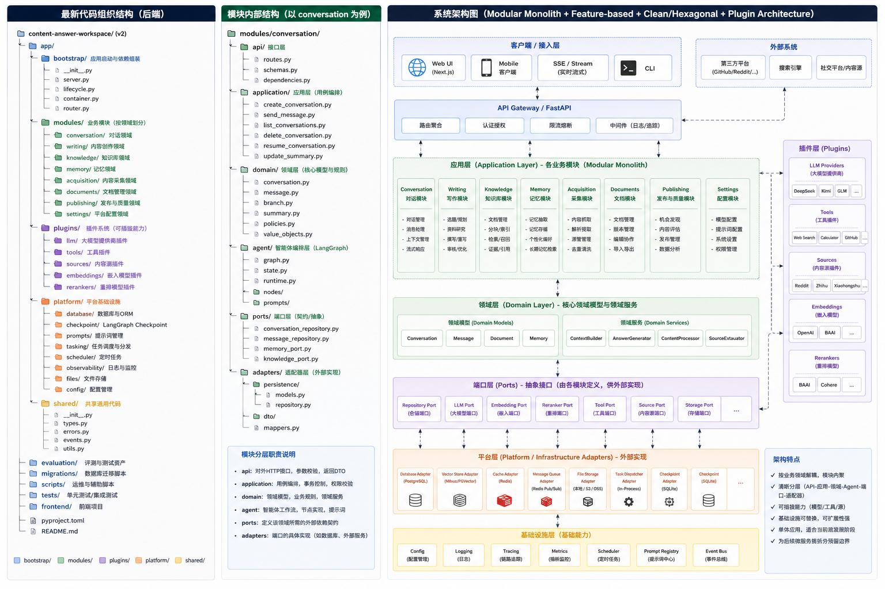
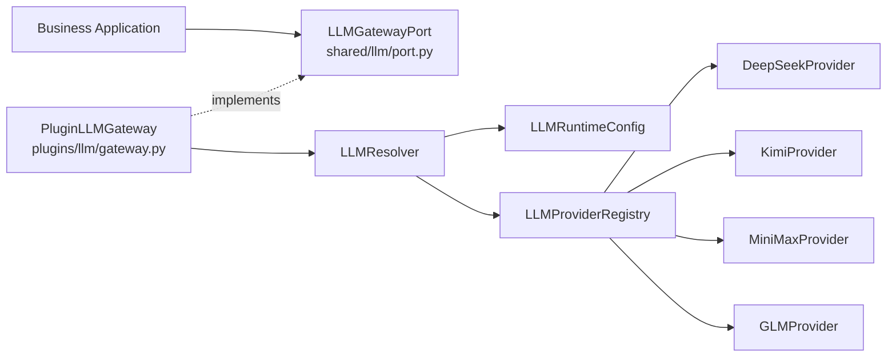
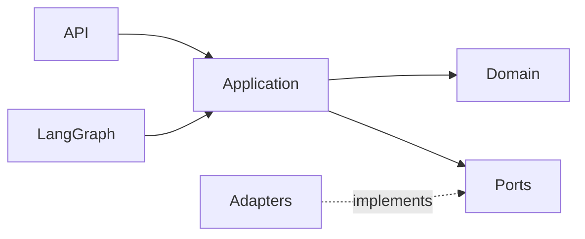
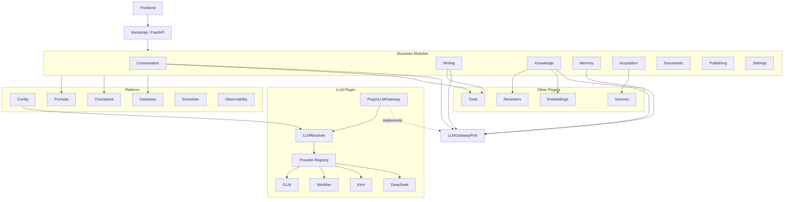

# Content Answer Workspace v2 架构重构提示词

你是一名资深 Python / FastAPI / LangGraph / Clean Architecture / Hexagonal Architecture 架构师。

请对以下仓库进行渐进式架构重构：

```text
Repository: LiuSandy/content-answer-workspace
Branch: v2
```

## 0. 强制范围

只允许：

```text
分析 v2
修改 v2
测试 v2
```

禁止：

```text
读取 main 作为实现依据
比较 main
修改其他分支
```

本次任务的核心是：

```text
代码组织
模块边界
依赖方向
LLM Plugin
Ports / Adapters
Composition Root
```

不是重新设计产品。

必须尽量保持：

```text
API 行为不变
数据库 Schema 不变
SSE 协议不变
LangGraph 工作流语义不变
Prompt 内容不变
前端调用协议不变
现有测试语义不变
```

禁止为了追求目录形式而大规模重写业务逻辑。

---

# 1. 本次架构的最终决策

以下内容已经确定，重构过程中不得重新解释成其他方案。

---

## 1.1 Application 到 LLM 的唯一依赖方式

Application **禁止直接调用 `LLMResolver`**。

Application 只能依赖：

```text
LLMGatewayPort
```

完整调用链固定为：

```text
Business Application
        ↓
LLMGatewayPort
        ↓
PluginLLMGateway
        ↓
LLMResolver
        ↓
LLMProviderRegistry
        ↓
LLMProvider
        ↓
DeepSeek / Kimi / MiniMax / GLM
```

因此禁止：

```text
Application → LLMResolver
Application → LLMProviderRegistry
Application → DeepSeekProvider
Application → KimiProvider
Application → MiniMaxProvider
Application → GLMProvider
```

正确方式：

```python
class MemoryExtractionUseCase:
    def __init__(self, llm: LLMGatewayPort):
        self._llm = llm
```

Application 只知道：

```text
LLMGatewayPort
```

它不知道：

```text
Resolver
Registry
Provider
SDK
Base URL
API Key
具体模型厂商
```

---

# 2. Provider / Model 的唯一配置源

必须解决当前 Provider / Model 配置散落的问题。

## 2.1 唯一运行时配置对象

整个系统只有一个 Provider / Model 路由配置对象：

```text
LLMRuntimeConfig
```

定义在：

```text
app/shared/llm/config.py
```

所有 LLM Provider / Model 路由都必须来自该对象。

禁止以下组件自行读取 Provider / Model 配置：

```text
Application
LangGraph Node
LLMProvider
LLMRegistry
Memory
Writer
Conversation
Knowledge
```

它们不得自行读取：

```text
os.getenv("LLM_PROVIDER")
os.getenv("DEEPSEEK_MODEL")
数据库 Settings
TOML
YAML
```

Provider / Model 的配置读取只能发生在：

```text
platform/config/llm.py
```

并最终产生一个：

```text
LLMRuntimeConfig
```

交给 Bootstrap 注入。

---

## 2.2 配置文件

Provider / Model 的默认路由配置统一放在：

```text
app/platform/config/defaults/llm.toml
```

例如：

```toml
[llm.default]
provider = "deepseek"
model = "deepseek-chat"

[llm.purposes."conversation.chat"]
provider = "deepseek"
model = "deepseek-chat"

[llm.purposes."memory.extraction"]
provider = "glm"
model = "glm-4-flash"

[llm.purposes."writing.generate"]
provider = "kimi"
model = "kimi-k2"

[llm.purposes."writing.planner"]
provider = "kimi"
model = "kimi-k2"

[llm.purposes."writing.review"]
provider = "deepseek"
model = "deepseek-reasoner"

[llm.purposes."knowledge.query_rewrite"]
provider = "minimax"
model = "MiniMax-M2.1"
```

具体模型名必须根据项目真实可用配置迁移，不允许为了示例覆盖当前可工作的模型配置。

---

## 2.3 Provider / Model 配置优先级

Provider / Model 的最终解析优先级固定为：

```text
Purpose Binding
    ↓
Default Binding
    ↓
Provider Default Model
```

即：

### 第一优先级

```text
llm.purposes.<purpose>
```

例如：

```text
memory.extraction
```

明确配置：

```text
provider = glm
model = xxx
```

则使用该配置。

### 第二优先级

如果没有对应 Purpose：

```text
llm.default
```

### 第三优先级

如果已经确定 Provider，但 Purpose 没有声明 model：

```text
ProviderConfig.default_model
```

---

## 2.4 禁止业务层覆盖模型

业务 Application 不允许：

```python
llm.generate(
    provider="deepseek",
    model="deepseek-chat",
)
```

也不允许：

```python
resolver.resolve(...)
```

业务层只能声明：

```python
purpose="memory.extraction"
```

例如：

```python
await self._llm.generate_structured(
    purpose="memory.extraction",
    ...
)
```

模型选择是基础设施策略，不是业务逻辑。

---

## 2.5 Environment 的职责

环境变量只负责：

```text
API Key
Base URL
Timeout
网络配置
部署级 Secret
```

例如：

```dotenv
DEEPSEEK_API_KEY=
DEEPSEEK_BASE_URL=

KIMI_API_KEY=
KIMI_BASE_URL=

MINIMAX_API_KEY=
MINIMAX_BASE_URL=

GLM_API_KEY=
GLM_BASE_URL=
```

禁止继续使用：

```dotenv
LLM_PROVIDER=deepseek
```

作为全系统模型选择机制。

Provider / Model 路由统一由：

```text
LLMRuntimeConfig
```

负责。

---

# 3. `generate_structured()` 的唯一所有者

`generate_structured()` **属于 Gateway，不属于具体 Provider。**

最终接口：

```python
class LLMGatewayPort(Protocol):

    async def generate(
        self,
        *,
        purpose: str,
        request: LLMRequest,
    ) -> LLMResponse:
        ...

    async def stream(
        self,
        *,
        purpose: str,
        request: LLMRequest,
    ) -> AsyncIterator[LLMStreamEvent]:
        ...

    async def invoke_with_tools(
        self,
        *,
        purpose: str,
        request: AgentLLMRequest,
    ) -> AgentLLMResponse:
        ...

    async def generate_structured(
        self,
        *,
        purpose: str,
        request: StructuredLLMRequest,
    ) -> StructuredLLMResponse:
        ...
```

定义位置：

```text
app/shared/llm/port.py
```

具体实现：

```text
app/plugins/llm/gateway.py
```

---

## 3.1 Provider 的职责

Provider 只负责：

```text
厂商 API 适配
Request 转换
Response 转换
Streaming
Tool Calling
厂商异常转换
Capability 声明
```

例如：

```python
class DeepSeekProvider(LLMProvider):

    async def generate(...):
        ...

    async def stream(...):
        ...

    async def invoke_with_tools(...):
        ...

    def capabilities(...) -> LLMCapabilities:
        ...
```

Provider 不负责跨 Provider 的结构化输出降级策略。

---

## 3.2 Gateway 的结构化输出职责

`PluginLLMGateway.generate_structured()` 负责：

```text
解析 purpose
↓
Resolver 选择 Provider + Model
↓
检查 Provider Capability
↓
选择 Structured Output 策略
↓
调用 Provider
↓
Schema 校验
↓
Retry / Fallback
↓
统一 StructuredLLMResponse
```

例如：

```text
json_schema
    ↓ 不支持
json_mode
    ↓ 不支持
prompt + parse
```

三级降级属于：

```text
Gateway / Structured Generation Strategy
```

而不是：

```text
DeepSeekProvider
KimiProvider
MiniMaxProvider
GLMProvider
```

---

# 4. Conversation Summary 与 Context Composition 的唯一所有者

必须消除当前：

```text
services/context/
services/memory/
conversation
```

之间职责重叠的问题。

---

## 4.1 Conversation Summary

唯一所有者：

```text
Conversation Module
```

路径：

```text
app/modules/conversation/
```

建议：

```text
conversation/
├── application/
│   └── update_conversation_summary.py
│
├── domain/
│   └── conversation_summary.py
│
└── ports/
    └── summarizer.py
```

Conversation Summary 属于：

```text
Conversation 生命周期
Conversation Branch
Conversation History
```

因此禁止放入：

```text
Memory Module
shared/context
plugins
platform
```

---

# 5. Context Composition 的所有权

不建立全局：

```text
Context Module
```

也不建立：

```text
shared/context/
```

Context Composition 属于**实际消费 Context 的业务模块**。

---

## 5.1 Conversation Context

Conversation Chat 使用的 Context：

```text
Conversation History
Conversation Summary
Long-term Memory
Knowledge Evidence
Current User Message
Tool Context
```

由：

```text
modules/conversation/application/
```

负责组合。

例如：

```text
conversation/
└── application/
    └── compose_chat_context.py
```

调用：

```text
MemoryPort
KnowledgePort
ConversationRepositoryPort
```

---

## 5.2 Writing Context

Writer 使用的：

```text
Writing Background
Reference Sources
Memory Preference
Knowledge Evidence
Outline
Document State
```

由：

```text
modules/writing/application/
```

负责。

例如：

```text
writing/
└── application/
    └── compose_writing_context.py
```

---

## 5.3 Memory Module 不再负责通用 Context

Memory Module 只负责：

```text
长期记忆抽取
长期记忆检索
长期记忆确认
用户偏好
工作习惯
写作风格记忆
Memory Persistence
```

Memory 不负责：

```text
Conversation Context Composition
Writing Context Composition
Conversation Summary
```

---

# 6. LLM Provider 最终清单

当前 `v2` 已经存在的 Provider：

```text
DeepSeek
Kimi
MiniMax
```

目标架构新增：

```text
GLM
```

因此本次重构完成后的 Provider 清单固定为：

```text
DeepSeekProvider
KimiProvider
MiniMaxProvider
GLMProvider
```

最终目录：

```text
app/plugins/llm/providers/
├── deepseek/
├── kimi/
├── minimax/
└── glm/
```

---

## 6.1 OpenAICompatible 不是 Provider

以下内容：

```text
OpenAICompatibleClient
OpenAICompatibleAdapter
```

只能作为公共实现工具。

例如：

```text
plugins/llm/common/openai_compatible.py
```

它不是：

```text
LLM Provider
```

禁止注册：

```text
openai_compatible
```

到 Provider Registry。

---

## 6.2 OpenAI 不在本次 Provider 清单

如果当前 `v2` 没有独立 `OpenAIProvider`，本次重构不要擅自新增。

本次目标只包括：

```text
deepseek
kimi
minimax
glm
```

以后如果需要 OpenAI：

```text
plugins/llm/providers/openai/
```

单独新增即可。

---

# 7. 最终整体架构

采用：

```text
Modular Monolith
+
Feature-based
+
Clean / Hexagonal Architecture
+
Plugin Architecture
```

总体结构：

```text
app/
│
├── bootstrap/
├── modules/
├── plugins/
├── platform/
└── shared/
```

职责：

```text
bootstrap/ → 应用如何组装
modules/   → 业务是什么
plugins/   → 可替换能力
platform/  → 系统基础设施
shared/    → 稳定的跨模块基础契约
```

---

# 8. 目标代码结构



```text
content-answer-workspace/
│
├── app/
│   │
│   ├── bootstrap/
│   │   ├── server.py
│   │   ├── lifecycle.py
│   │   ├── container.py
│   │   └── router.py
│   │
│   ├── modules/
│   │   │
│   │   ├── conversation/
│   │   │   ├── api/
│   │   │   ├── application/
│   │   │   │   ├── send_message.py
│   │   │   │   ├── resume_conversation.py
│   │   │   │   ├── update_conversation_summary.py
│   │   │   │   └── compose_chat_context.py
│   │   │   ├── domain/
│   │   │   │   ├── conversation.py
│   │   │   │   ├── message.py
│   │   │   │   ├── branch.py
│   │   │   │   └── conversation_summary.py
│   │   │   ├── agent/
│   │   │   │   ├── graph.py
│   │   │   │   ├── state.py
│   │   │   │   ├── runtime.py
│   │   │   │   ├── nodes/
│   │   │   │   └── prompts/
│   │   │   ├── ports/
│   │   │   └── adapters/
│   │   │
│   │   ├── writing/
│   │   │   ├── api/
│   │   │   ├── application/
│   │   │   │   ├── generate_document.py
│   │   │   │   ├── rewrite_document.py
│   │   │   │   ├── review_document.py
│   │   │   │   └── compose_writing_context.py
│   │   │   ├── domain/
│   │   │   ├── agent/
│   │   │   ├── ports/
│   │   │   └── adapters/
│   │   │
│   │   ├── knowledge/
│   │   │   ├── api/
│   │   │   ├── application/
│   │   │   ├── domain/
│   │   │   ├── ports/
│   │   │   └── adapters/
│   │   │
│   │   ├── memory/
│   │   │   ├── api/
│   │   │   ├── application/
│   │   │   │   ├── extract_memory.py
│   │   │   │   ├── retrieve_memory.py
│   │   │   │   ├── confirm_memory.py
│   │   │   │   └── update_memory.py
│   │   │   ├── domain/
│   │   │   ├── ports/
│   │   │   └── adapters/
│   │   │
│   │   ├── acquisition/
│   │   │   ├── api/
│   │   │   ├── application/
│   │   │   ├── domain/
│   │   │   ├── ports/
│   │   │   └── adapters/
│   │   │
│   │   ├── documents/
│   │   │   ├── api/
│   │   │   ├── application/
│   │   │   ├── domain/
│   │   │   ├── ports/
│   │   │   └── adapters/
│   │   │
│   │   ├── publishing/
│   │   │   ├── api/
│   │   │   ├── application/
│   │   │   ├── domain/
│   │   │   ├── ports/
│   │   │   └── adapters/
│   │   │
│   │   └── settings/
│   │       ├── api/
│   │       ├── application/
│   │       ├── domain/
│   │       ├── ports/
│   │       └── adapters/
│   │
│   ├── plugins/
│   │   │
│   │   ├── llm/
│   │   │   ├── gateway.py
│   │   │   ├── resolver.py
│   │   │   ├── registry.py
│   │   │   ├── capabilities.py
│   │   │   ├── structured.py
│   │   │   ├── common/
│   │   │   │   └── openai_compatible.py
│   │   │   └── providers/
│   │   │       ├── deepseek/
│   │   │       │   ├── provider.py
│   │   │       │   ├── client.py
│   │   │       │   └── registration.py
│   │   │       ├── kimi/
│   │   │       ├── minimax/
│   │   │       └── glm/
│   │   │
│   │   ├── tools/
│   │   │   ├── registry.py
│   │   │   ├── builtin/
│   │   │   ├── web/
│   │   │   └── platforms/
│   │   │
│   │   ├── sources/
│   │   ├── embeddings/
│   │   └── rerankers/
│   │
│   ├── platform/
│   │   ├── config/
│   │   │   ├── llm.py
│   │   │   └── defaults/
│   │   │       └── llm.toml
│   │   ├── database/
│   │   ├── checkpoint/
│   │   ├── prompts/
│   │   ├── scheduler/
│   │   ├── tasking/
│   │   ├── files/
│   │   └── observability/
│   │
│   └── shared/
│       ├── llm/
│       │   ├── port.py
│       │   ├── dto.py
│       │   ├── config.py
│       │   └── errors.py
│       ├── errors.py
│       ├── types.py
│       └── events.py
│
├── frontend/
├── evaluation/
├── migrations/
├── tests/
├── scripts/
├── pyproject.toml
└── docker-compose.yml
```

---

# 9. LLM 架构图



关键规则：

```text
Application 只看 Port。

Resolver、Registry、Provider
全部隐藏在 plugins/llm 内部。

Bootstrap 负责把 Gateway 注入 Application。
```

---

# 10. Bootstrap 依赖组装

所有具体依赖只能在：

```text
bootstrap/container.py
```

完成。

例如：

```python
llm_config = load_llm_runtime_config()

llm_registry = build_llm_registry(...)

llm_resolver = LLMResolver(
    config=llm_config,
    registry=llm_registry,
)

llm_gateway = PluginLLMGateway(
    resolver=llm_resolver,
)

memory_extraction = MemoryExtractionUseCase(
    llm=llm_gateway,
)

conversation_service = ConversationRunUseCase(
    llm=llm_gateway,
)

writing_service = GenerateDocumentUseCase(
    llm=llm_gateway,
)
```

只有 Bootstrap 同时知道：

```text
Module
Plugin
Platform
```

---

# 11. 模块内部依赖规则

标准结构：

```text
module/
├── api/
├── application/
├── domain/
├── agent/
├── ports/
└── adapters/
```

标准依赖：



禁止：

```text
domain → infrastructure
domain → plugins
domain → SQLAlchemy
domain → FastAPI
domain → LangGraph

application → concrete Provider
application → LLMResolver
application → LLMRegistry
application → SQLAlchemy Model
```

---

# 12. LangGraph 的职责

LangGraph 只负责：

```text
State
Graph
Node orchestration
Conditional Edge
Tool Loop
Interrupt
HITL
Workflow Control
```

LangGraph Node 不负责：

```text
Provider 初始化
数据库基础设施初始化
业务 Repository 实现
模型路由配置
直接读取环境变量
```

Node 应调用：

```text
Application Use Case
```

或者非常薄的业务 Port。

---

# 13. Memory 重构重点

当前错误链：

```text
Memory
↓
LLMServiceAdapter
↓
AnswerGenerationService
↓
LLMProviderRegistry
↓
Provider
```

必须删除。

目标：

```text
MemoryExtractionUseCase
↓
LLMGatewayPort
↓
PluginLLMGateway
↓
LLMResolver
↓
Provider
```

并将：

```python
raw = await llm.analyze(...)
_parse_extraction_json(raw)
```

改为：

```python
result = await self._llm.generate_structured(
    purpose="memory.extraction",
    request=...,
)
```

定义：

```python
class ExtractedMemory(BaseModel):
    memory_type: ...
    memory_scope: ...
    content: str
    confidence: float
    evidence: str | None


class MemoryExtractionResult(BaseModel):
    items: list[ExtractedMemory]
```

Memory Application 不负责自己从字符串中截取 JSON。

---

# 14. Database Ownership

不要继续把全部业务 ORM Model 放在：

```text
platform/database/models/
```

改成：

```text
modules/conversation/adapters/persistence/
modules/memory/adapters/persistence/
modules/knowledge/adapters/persistence/
modules/documents/adapters/persistence/
modules/publishing/adapters/persistence/
```

而：

```text
platform/database/
```

只拥有：

```text
Engine
Session
Base
Transaction
Lifecycle
```

原则：

```text
Platform 决定怎么连接数据库。

Module 决定自己的数据怎么存储。
```

---

# 15. Plugin Ownership

以下能力属于 Plugins：

```text
LLM
Tool
Source
Embedding
Reranker
```

Plugin 必须可替换。

---

## LLM

```text
DeepSeek
Kimi
MiniMax
GLM
```

---

## Sources

例如：

```text
Zhihu
Xiaohongshu
Universal
```

---

## Tools

例如：

```text
Web Search
Web Fetch
GitHub
Reddit
Zhihu
Xiaohongshu
Bilibili
V2EX
Calculator
Datetime
```

---

## Embeddings

Knowledge / Memory 通过：

```text
EmbeddingPort
```

访问。

---

## Rerankers

Knowledge 通过：

```text
RerankerPort
```

访问。

---

# 16. 迁移阶段

禁止 Big Bang Rewrite。

必须采用渐进式迁移。

---

## Phase 1

建立：

```text
bootstrap/
modules/
plugins/
platform/
shared/
```

不删除旧代码。

---

## Phase 2

重构 LLM 基础设施：

```text
shared/llm
plugins/llm
platform/config/llm.py
```

建立：

```text
LLMGatewayPort
PluginLLMGateway
LLMResolver
LLMProviderRegistry
LLMRuntimeConfig
LLMCapabilities
Structured Generation Strategy
```

迁移：

```text
DeepSeek
Kimi
MiniMax
```

新增：

```text
GLM
```

---

## Phase 3

迁移 Memory。

重点删除：

```text
Memory
→ LLMServiceAdapter
→ AnswerGenerationService
```

并切换：

```text
Memory
→ LLMGatewayPort
```

---

## Phase 4

迁移 Conversation。

同时把：

```text
Conversation Summary
Conversation Context Composition
```

统一收归：

```text
modules/conversation/
```

保留现有 ChatGraph 行为。

---

## Phase 5

迁移 Writing。

同时建立：

```text
Writing Context Composition
```

保留 WriterGraph 的现有：

```text
Planner
Research
Write
Review
Memory Node
Finalize
```

工作流语义。

---

## Phase 6

迁移 Knowledge。

建立：

```text
EmbeddingPort
RerankerPort
DocumentParserPort
KnowledgeRepositoryPort
```

---

## Phase 7

迁移 Acquisition。

将：

```text
ZhihuSource
XiaohongshuSource
UniversalSource
```

移入：

```text
plugins/sources/
```

---

## Phase 8

迁移：

```text
Documents
Publishing
Settings
```

---

## Phase 9

拆分：

```text
ORM Models
Repositories
Ports
```

到模块内部。

---

## Phase 10

在确认所有引用和测试迁移完成后，删除旧：

```text
app/services/
app/agents/
app/contracts/
app/infrastructure/
```

中已经完成迁移且不再使用的部分。

禁止留下两套长期并行实现。

---

# 17. 测试与验收

每个 Phase 都必须：

```text
运行测试
检查 Import
检查循环依赖
检查 API 兼容性
检查 SSE
检查 LangGraph
检查 DB
```

不得等到最后统一修复。

---

# 18. 架构验收规则

重构完成后：

### Conversation

修改 Conversation 功能时，主要修改：

```text
modules/conversation/
```

### Memory

修改 Memory 时，主要修改：

```text
modules/memory/
```

### Writing

修改 Writing 时，主要修改：

```text
modules/writing/
```

### Provider

增加 Provider 时：

```text
plugins/llm/providers/
```

不得修改：

```text
modules/conversation
modules/memory
modules/writing
modules/knowledge
```

---

# 19. LLM 验收规则

业务模块中搜索：

```text
LLMResolver
LLMProviderRegistry
DeepSeekProvider
KimiProvider
MiniMaxProvider
GLMProvider
AsyncOpenAI
ChatOpenAI
```

原则上都不应出现在：

```text
modules/*/application/
```

Application 应只出现：

```text
LLMGatewayPort
```

---

# 20. Context 验收规则

最终不存在模糊的：

```text
services/context/
shared/context/
```

职责固定为：

```text
Conversation Summary
→ Conversation

Conversation Context Composition
→ Conversation

Writing Context Composition
→ Writing

Long-term Memory
→ Memory

RAG Context / Evidence
→ Knowledge
```

---

# 21. 最终架构图



---

# 22. 开始执行前必须先分析

不要直接修改代码。

首先输出：

```text
1. v2 当前真实目录结构

2. 当前 Conversation / Writing / Memory / Knowledge /
   Acquisition / Documents / Publishing / Settings 的文件归属

3. 当前所有 LLM 调用点

4. 当前 Provider 配置来源

5. 当前 DeepSeek / Kimi / MiniMax Provider 实现

6. GLM 需要新增的位置

7. 当前 Conversation Summary 实现位置

8. 当前 Context Composition 实现位置

9. 当前模块之间的真实 Import 依赖

10. 新旧目录映射表

11. Phase 1~10 的迁移计划

12. 每个 Phase 的风险点
```

只有分析完成后才能开始代码修改。

---

# 23. 每阶段输出格式

每完成一个 Phase，只输出与该阶段有关的信息：

```text
Phase X 完成

新增：
- ...

迁移：
- ...

删除：
- ...

依赖变化：
- ...

兼容处理：
- ...

测试：
- ...

遗留问题：
- ...

下一阶段：
- ...
```

禁止输出大量泛泛的架构理论。

---

# 24. 最终目标

最终依赖关系必须变成：

```text
Business Application
        ↓
       Port
        ↑
Concrete Adapter / Plugin
```

LLM 必须是：

```text
Application
    ↓
LLMGatewayPort
    ↓
PluginLLMGateway
    ↓
LLMResolver
    ↓
LLMProviderRegistry
    ↓
Provider
```

Context 所有权必须是：

```text
Conversation Summary
        → Conversation

Conversation Context
        → Conversation

Writing Context
        → Writing

Long-term Memory
        → Memory

RAG Evidence
        → Knowledge
```

Provider 最终固定为：

```text
DeepSeek
Kimi
MiniMax
GLM
```

Provider / Model 路由统一来自：

```text
LLMRuntimeConfig
```

`generate_structured()` 统一由：

```text
PluginLLMGateway
```

负责。

最终达到：

```text
高内聚
低耦合
业务边界清晰
依赖方向稳定
Application 不依赖具体基础设施
LangGraph 只负责工作流编排
LLM Provider 可替换
Model 可按 Purpose 路由
Structured Output 策略统一
Context Ownership 唯一
Provider 配置源唯一
Plugin 可独立扩展
```